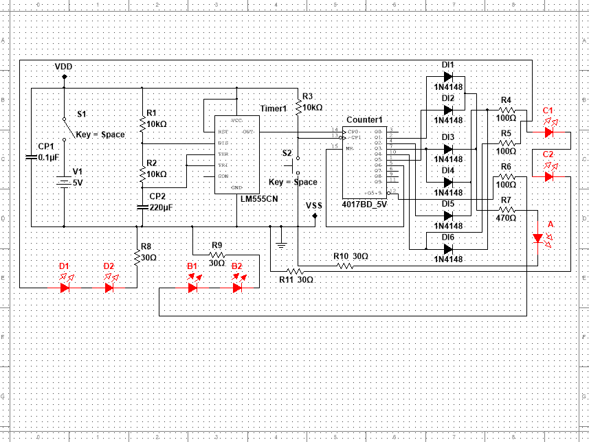

# Embedded Programming and Electronics Design

STM32 firmware and analogue/digital circuit design coursework from my MSc at the University of Essex: a reaction timer game on the STM32F412G-DISCO board, and two 555-timer circuits (a photopopper and a digital dice) designed in NI Multisim and laid out in Ultiboard.

## Overview

| Project | Module | Tools | Main files |
|---|---|---|---|
| Reaction timer game | CE865 | STM32CubeIDE, STM32 HAL, STM32F412G-DISCO BSP | `main.c`, `final_assignment.ioc` |
| Photopopper (solar energy-harvesting burst circuit) | CE721 Assignment 1 | NI Multisim, Ultiboard | `Assignment1.ms14`, `Assignment1_PCB_4.ewprj`, `Assignment1_PCB.ewnet`, `Assignment_1_Report.pdf` |
| Digital dice (555 + CD4017) | CE721 Assignment 2 | NI Multisim, Ultiboard | `Assignment2.ms14`, `Assignment2_testing.ms14`, `Assignment2_PCB_new.ewprj`, `Assignment_2_Report.pdf` |

## Features

### STM32 reaction timer (`main.c`)
- Target: STM32F412ZGTx on the STM32F412G-DISCO board, with an LED/button shield.
- Non-blocking finite state machine (`IDLE`, `CD`, `CD_PAUSE`, `R_READY`, `TIMING`, `RESULT`) driven by a 1 ms TIM6 interrupt, with no blocking delays.
- 8 bi-colour LEDs driven by bit-banging a 16-bit pattern into an SN74LV164 shift register. Each LED has off, red, green and orange states.
- 8 push buttons read as two multiplexed groups of four, debounced in the timer ISR with a 20 ms stability threshold.
- Game flow: press BTN1 to start, then the LEDs count down from right to left every 500 ms (pausing while any button is held). A random LED turns green and the player presses the matching button. Reaction time is measured in milliseconds and capped at 9.999 s.
- Reaction time shown on the on-board LCD via the BSP LCD driver. A linear congruential generator picks the target LED.

### Photopopper (Assignment 1)
- Low-power energy-harvesting circuit: a limited supply slowly charges a large capacitor, and a 555 timer in monostable mode fires a short motor pulse once a threshold is reached.
- Subsystems: power source model, energy storage, diode threshold network, 555 control and a 2N3904 transistor motor drive.
- Multisim simulation, Ultiboard PCB layout with a passing design rule check, bill of materials, and a breadboard demonstration.



| LED off (charging) | LED on (discharge) |
|---|---|
|  |  |

### Digital dice (Assignment 2)
- An NE555 in astable mode clocks a CD4017 decade counter wired as a MOD-6 counter (Q6 to reset).
- A diode OR network maps the counter outputs to a traditional six-face LED dice pattern. A push button controls counting and hold.
- Verified in Multisim with a logic analyser and oscilloscope, with a PCB layout in Ultiboard.

## Repository structure

```
embedded_programming_stm32/
├── main.c                          # STM32 reaction timer firmware (CubeMX-generated main.c with user code)
├── final_assignment.ioc            # STM32CubeMX project configuration
├── Assignment1.ms14                # Photopopper Multisim design
├── Assignment1_PCB_4.ewprj         # Photopopper Ultiboard project
├── Assignment1_PCB.ewnet           # Photopopper netlist
├── Assignment_1_Report.pdf         # Photopopper report
├── Assignment2.ms14                # Digital dice Multisim design
├── Assignment2_testing.ms14        # Digital dice test bench
├── Assignment2_PCB_new.ewprj       # Digital dice Ultiboard project
├── Assignment_2_Report.pdf         # Digital dice report
├── MULTISIM_Circuit_Schematic.png  # Photopopper schematic
├── LED OFF.jpg, LED ON.jpg         # Photopopper breadboard photos
└── *(Security copy)                # Multisim / Ultiboard backup files
```

## Tech stack

C, STM32 HAL, STM32CubeIDE / STM32CubeMX (STM32Cube FW_F4 V1.28.3), STM32F412G-DISCO BSP (LCD), NI Multisim, NI Ultiboard.

## How to build and run

**STM32 reaction timer**
1. Open `final_assignment.ioc` in STM32CubeIDE and generate the project code (target: STM32F412ZGTx, STM32F412G-DISCO).
2. Replace `Core/Src/main.c` with `main.c` from this repository.
3. Add the STM32F412G-DISCO BSP drivers (`stm32412g_discovery.h`, `stm32412g_discovery_lcd.h`, `stm32412g_discovery_ts.h` and their sources) to the include and source paths.
4. Build and flash to the board, then press BTN1 on the shield to start a round.

**Circuits**
Open the `.ms14` files in NI Multisim to run the simulations, and the `.ewprj` files in NI Ultiboard to view the PCB layouts. Design details, calculations and measurements are in the two PDF reports.

## Results

From the reports:
- Photopopper: simulation and the breadboard build matched the expected charge and threshold discharge behaviour. Testing showed that an LED load could not discharge the capacitor cleanly, so the load was modelled as a 20 Ω resistor switched by a 2N3904 transistor.
- Digital dice: logic analyser and oscilloscope measurements confirmed correct MOD-6 sequencing. The measured 4.5 s period agreed with the astable timing calculation for the 220 µF timing capacitor.

## Author

Goktug Can Simay, Robotics Software Engineer
[GitHub](https://github.com/simaygoktug) | [goktugcansimay.com](https://goktugcansimay.com)
